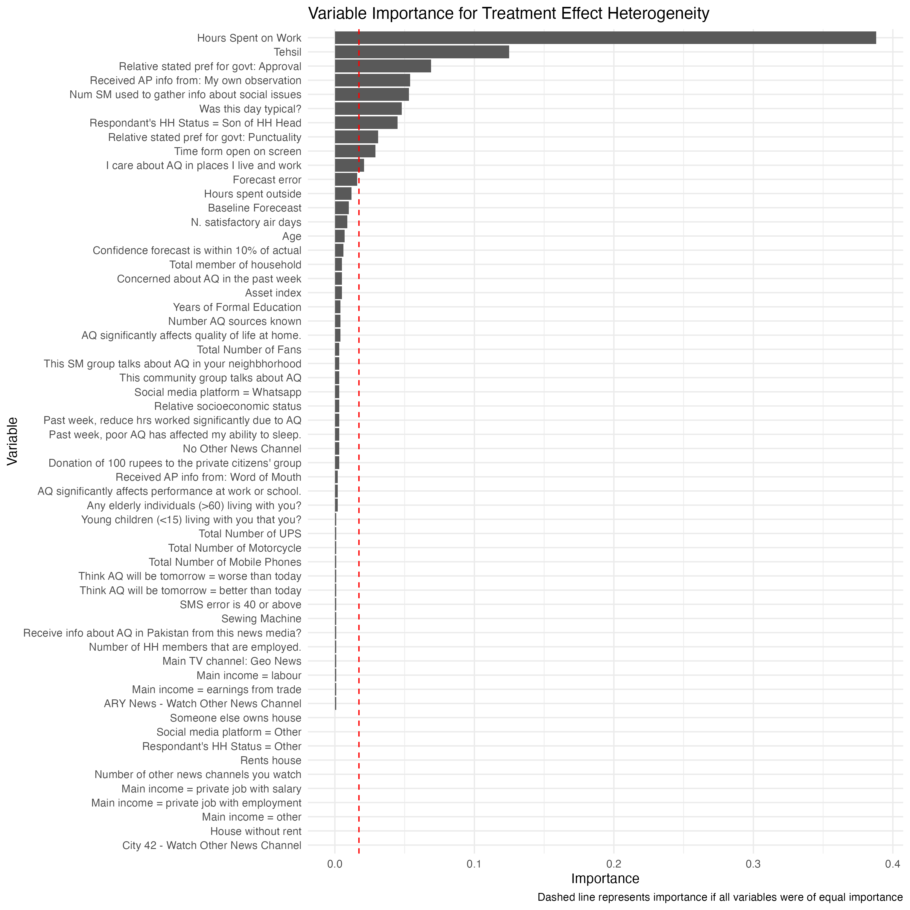
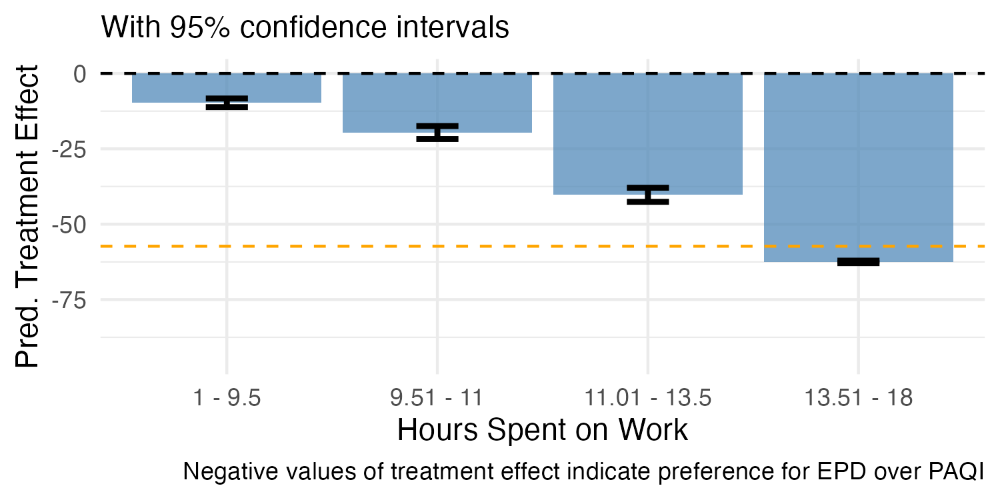
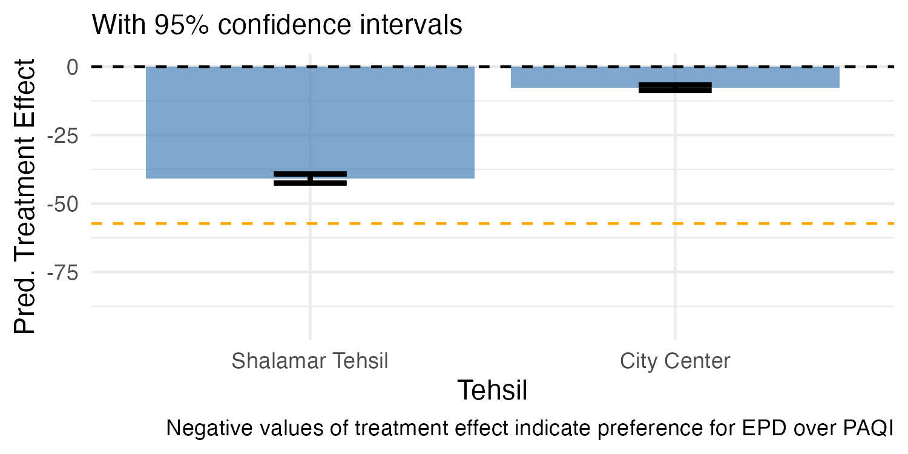
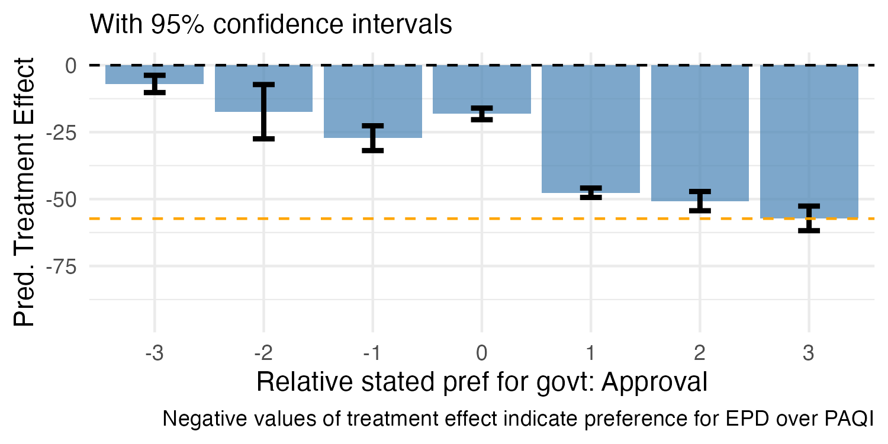

---
output:
    pdf_document
---

I analyzed heterogeneous treatment effects for air quality forecasting using causal forests. 

Treatment = attribution to EPD (vs. PAQI). 

Outcome = relative WTP, coded as WTP_PAQI - WTP_EPD. 

All treatment effects are negative, meaning EPD attribution consistently reduces 
relative WTP (increases EPD preference). The analysis just tries to identify which household 
characteristics make this effect stronger.

## Variable Importance




Three variables account for the majority of treatment effect heterogeneity:
hours spent on work (importance = 0.40), location/tehsil (importance = 0.10),
and baseline relative government approval (importance = 0.05). Together, these explain
55% of variation in treatment effects.

\newpage

## Work Hours
```{r, echo = FALSE, message = FALSE}
library(knitr)
library(tidyverse)

results_table <- data.frame(
  Term = c("(Intercept)", "Work Hours"),
  Estimate = c(62.46435, -8.26041),
  `Std. Error` = c(4.70498, 0.39808),
  `t value` = c(13.276, -20.751),
  `P-Value` = c("< 2.2e-16", "< 2.2e-16")
)

kable(results_table, digits = 3, caption = "Best linear projection of work hours on treatment")
```

Each additional hour worked per week decreases the treatment effect by 8.3 PKR 
(p < 0.001). This means households working more hours develop substantially 
stronger preferences for EPD attribution.


The dashed line is the (negative) average of willingness to pay over PAQI and EPD forecasting. 




This plot also reflects that as work hours increase, treatment effect becomes more negative (more preference for EPD forecasting. )

## Location:



People living in Shalamar have a much more negative treatment effect. 

## Approval index:



People with a positive approval for the government are more receptive to the EPD treatment. 