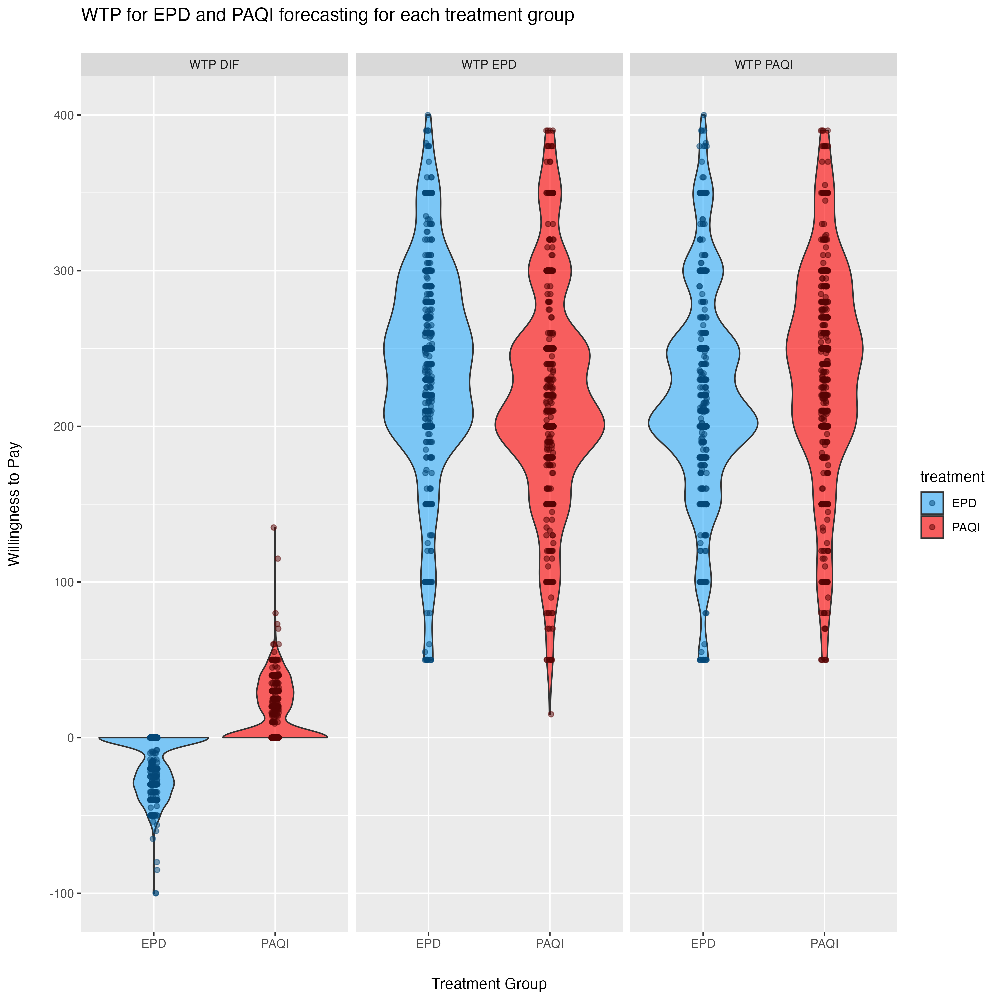

\newpage
\tableofcontents
\newpage

# Executive Summary

This repository contains an exploratory empirical analysis examining willingness to pay (WTP) for air quality forecasting services in Punjab, Pakistan. The study investigates which variables predict WTP and examines how treatment attribution to different sources—EPD (Environmental Protection Department, government-run) versus PAQI (Pakistan Air Quality Initiative, citizen-run)—affects consumer preferences.

The analysis began as a purely exploratory investigation into what factors predict WTP for air quality forecasting. After testing multiple statistical approaches (OLS, Lasso, Bayesian Spike-and-Slab), the data revealed that treatment assignment was the dominant predictor, explaining 41.6% to 67.2% of variance in relative WTP depending on the treatment group. This finding motivated a shift in focus toward understanding heterogeneous treatment effects using causal forests.

**Key Finding:** Treatment assignment dominates all other factors in predicting relative WTP preferences. Few demographic, behavioral, or household variables consistently predict absolute WTP. However, causal forest analysis reveals meaningful heterogeneity in treatment effects, with work hours (as an income proxy), geographic location, and baseline government approval explaining approximately 55% of treatment effect variation.

\newpage

# 1. Research Context and Design

## 1.1 Research Question

The study began with an exploratory question: **What variables predict willingness to pay for air quality forecasting services?**

This was not a hypothesis-driven study testing whether specific variables (A) affect outcomes (B). Rather, it was a data-driven exploration allowing multiple analytical methods to identify which variables, if any, consistently predict WTP outcomes.

## 1.2 Study Context

- **Location**: Punjab, Pakistan (households in Shalamar and City Center tehsils)
- **Public health context**: Severe air pollution with documented negative health and educational outcomes
- **Experimental design**: Randomized controlled trial with treatment assignment
- **Treatment arms**:
  - **EPD treatment**: Households received air quality forecasting **attributed to EPD** (Environmental Protection Department, government-run)
  - **PAQI treatment**: Households received air quality forecasting **attributed to PAQI** (Pakistan Air Quality Initiative, citizen-run)

**Critical note**: The forecasting content was **identical** across both treatment groups. The only difference was the source attribution (EPD vs. PAQI). This allows isolation of the effect of source credibility on WTP preferences.

## 1.3 Data Collection

- **Study design**: Two-stage survey with baseline and endline measurements at the household level
- **Survey administration**: Whoever answered the door/agreed to participate provided responses for their household
- **Key measurement categories**:
  - **Demographic variables**: Age, education, household composition, location
  - **Economic proxies**: Work hours (no direct income variable collected)
  - **Behavioral variables**: Time spent on air quality information, forecast error rates when guessing
  - **Attitudinal measures**: Air pollution concern, government approval, preference indices
  - **Outcome measures**: BDM (Bidding Data Model) for WTP elicitation

**Note on income**: The dataset does not include a direct income variable. Work hours serves as an income proxy, which is reasonable in the Pakistan context based on domain knowledge showing that individuals with lower incomes tend to have lower trust in government institutions.

\newpage

# 2. Data Preprocessing

## 2.1 Data Cleaning Pipeline

The preprocessing pipeline (file: `trimming_data/creating_datasets_run.R`) includes:

### Variable Selection and Recoding
- Initially, fewer variables were selected for analysis
- The final approach uses as many baseline variables as possible to be truly exploratory and let the data guide variable selection
- Education recoded into 7 categorical levels (no formal education through postgraduate)
- Likert scales standardized (1-5 scale)
- Binary preference outcomes created from preference indices

### Outcome Variables
Three primary outcomes were constructed:

- `wtp_paqi`: Willingness to pay for PAQI forecasting
- `wtp_epd`: Willingness to pay for EPD forecasting
- `wtp_dif`: **Relative WTP** (wtp_paqi - wtp_epd) — primary outcome of interest

### Quality Control Procedures
1. **Outlier detection**: Z-score threshold = 4 to identify extreme values
2. **High-frequency variable removal**: Dropped variables with >85% concentration in single response category
3. **Multiple imputation**: Median (numeric) and mode (categorical) strategies for missing data
4. **VIF-based multicollinearity check**: Threshold = 2.5 to remove redundant predictors
5. **Rare factor level combination**: Merged factor levels with <2% frequency to avoid overfitting

\newpage

# 3. Exploratory Analysis: Predicting Willingness to Pay

The exploratory analysis tested multiple statistical approaches to identify which variables, if any, consistently predict WTP. This was **not conducted in phases**—rather, different methods were applied in parallel to allow comparison and triangulation of results.

## 3.1 Analytical Approaches

### 3.1.1 Ordinary Least Squares Regression

**File**: `linear_regression_exploratory/OLS_exploratory.R`

- 6 model combinations: 2 treatment groups (EPD, PAQI) × 3 outcomes (WTP for PAQI, WTP for EPD, relative WTP)
- Full models with all baseline predictors
- Benjamini-Hochberg correction for multiple comparisons to control false discovery rate
- Variables with p < 0.05 considered for interpretation

### 3.1.2 Lasso Regression with Cross-Validation

**File**: `holdout_sets/lasso.R`

- L1-regularized regression with cross-validation for lambda selection
- **Sample splitting**: 70/30 train-test split for validation
- Variable selection based on non-zero coefficients at optimal lambda
- Compared Lasso → OLS pipeline performance against OLS alone

### 3.1.3 Bayesian Spike-and-Slab Prior

**File**: `spike_and_slab/spike_slab.R`

- BoomSpikeSlab implementation with 10,000 MCMC iterations
- Expected model size = 10 variables (prior specification)
- Posterior inclusion probabilities calculated for each predictor
- Analysis conducted on full dataset predicting relative WTP (wtp_dif)

**Results**: The highest posterior inclusion probability was relatively low, indicating substantial uncertainty about which variables truly predict relative WTP. Most variables had inclusion probabilities well below 50%, suggesting weak evidence for any individual predictor when treatment is not included in the model.

## 3.2 Comparison: OLS vs. Lasso

A key comparison examined whether machine learning variable selection (Lasso) improved predictive performance over standard OLS regression. Both approaches were compared on the same outcomes to evaluate whether regularization and automated variable selection provided benefits.

{width=85%}

**Figure 1**: Bayesian Spike-and-Slab posterior coefficient distributions showing relationship between inclusion probability and coefficient value. Most variables cluster near zero inclusion probability, indicating weak evidence for predictive value.

Table 1: **Model Performance Comparison - OLS vs. Lasso**

| Treatment Group | Outcome | OLS R² | OLS Variables | Lasso R² | Lasso Variables |
|:----------------|:--------|-------:|-------------:|--------:|---------------:|
| PAQI treatment | WTP PAQI | 0.239 | 3 | 0.109 | 18 (2) |
| PAQI treatment | WTP EPD | 0.235 | 7 | 0.032 | 4 (1) |
| PAQI treatment | WTP Diff | 0.608 | 8 | 0.555 | 47 (9) |
| EPD treatment | WTP PAQI | 0.224 | 5 | 0.040 | 11 (2) |
| EPD treatment | WTP EPD | 0.213 | 6 | 0.019 | 1 (1) |
| EPD treatment | WTP Diff | 0.672 | 14 | 0.609 | 40 (12) |

*Note: Lasso variables shown as "total selected (significant after OLS on selected variables)"*

**Key observation**: Lasso either did not improve R² over OLS or actually decreased it. For predicting relative WTP (the outcome with highest R² in both approaches), OLS achieved R² = 0.608-0.672 while Lasso achieved R² = 0.555-0.609. The machine learning approach with regularization did not provide additional predictive value beyond standard OLS.

## 3.3 Exploratory Analysis Results

### Few Variables Consistently Predict Absolute WTP

- No demographic, behavioral, or household variable robustly predicts absolute WTP across treatment groups
- Variables selected by OLS vary substantially by treatment group and outcome type
- Lasso selects many variables but with poor out-of-sample performance (low R²)
- Bayesian Spike-and-Slab typically selects 1-15 variables per model, with low posterior inclusion probabilities

### Treatment Assignment Dominates for Relative WTP

The models predicting relative WTP (wtp_dif) show substantially higher R² values:

- PAQI treatment group: R² = 0.555-0.608
- EPD treatment group: R² = 0.609-0.672

This pattern emerges consistently across all analytical methods, suggesting that treatment assignment is the primary driver of preferences for one service over the other.

\newpage

# 4. Treatment Effect Analysis

Given that relative WTP showed strong predictive performance while absolute WTP did not, the analysis shifted focus to understanding treatment effects.

## 4.1 Regression Models

**File**: `linear_regression_treatment_effect/OLS_treatment_effect.R`

Three model specifications were compared:

Table 2: **Treatment Effect Model Comparison (Full Dataset)**

| Model Specification | R² | F-statistic | Treatment Coefficient |
|:-------------------|----:|------------:|---------------------:|
| Treatment only | 0.4164 | 288.09*** | -31.9 |
| All covariates (no treatment) | 0.06 | 0.39 (ns) | — |
| Treatment + all covariates | 0.4564 | 8.41*** | -31.9 |

*Note: *** indicates p < 0.001; ns = not significant*

### Key Observations

1. Treatment alone explains **41.6% of variance** in relative WTP
2. All other variables combined (without treatment) explain only **6% of variance**
3. Adding covariates to the treatment model increases R² by only 4 percentage points (to 45.6%)
4. Treatment coefficient remains stable at approximately -31.9 PKR regardless of controls

### Stability Across Random Splits

To check stability of the treatment effect estimate, the full dataset was randomly split in half multiple times:

- Treatment coefficients range: -30.2 to -33.7 PKR
- R² range: 0.40 to 0.50
- Treatment remains highly significant (p < 0.001) across all splits

This indicates the treatment effect estimate is stable and not driven by particular observations.

## 4.2 Distribution of Relative Willingness to Pay

{width=75%}

**Figure 2**: Distribution of relative willingness to pay (WTP for PAQI minus WTP for EPD) by treatment assignment. The distribution clearly separates by treatment group, with EPD treatment recipients showing strong negative relative WTP (preferring EPD) and PAQI treatment recipients showing positive or near-zero relative WTP (preferring PAQI or indifferent).

## 4.3 Binary Preference Analysis

**File**: `linear_regression_treatment_effect/log_odds.R`

Logistic regression predicting binary preference for EPD vs. PAQI:

{width=75%}

**Figure 3**: Log-odds of preferring EPD over PAQI by treatment assignment. The plot shows near-perfect separation by treatment group, indicating that treatment assignment almost deterministically predicts which service a household will prefer.

**Statistical result**: Near-perfect separation by treatment (quasi-complete separation in logistic model)

**Interpretation**: Receiving EPD forecasting makes a household almost certain to prefer EPD over PAQI, and vice versa.

\newpage

# 5. Heterogeneous Treatment Effects

While treatment dominates overall preferences, there may be meaningful variation in treatment effects across different types of households. Causal forests provide a nonparametric approach to discovering such heterogeneity.

## 5.1 Causal Forest Implementation

**Files**:
- `linear_regression_treatment_effect/causal_forest/causal_forest.R`
- `linear_regression_treatment_effect/causal_forest/causal_forest_work_trimmed.R`

### Method Details

- **Algorithm**: Generalized Random Forest (grf package)
- **Number of trees**: 4,000 with honest splitting
- **Treatment variable**: EPD assignment (binary)
- **Outcome variable**: Relative WTP (wtp_dif)
- **Predictor variables**: 50+ baseline variables (demographic, economic, behavioral, attitudinal)

## 5.2 Variable Importance Rankings

{width=85%}

**Figure 4**: Variable importance rankings from causal forest showing which variables best predict heterogeneous treatment effects. Work hours dominates, followed by geographic location (tehsil) and baseline government approval.

Table 3: **Top Predictors of Treatment Effect Heterogeneity**

| Variable | Importance Score | Interpretation |
|:---------|----------------:|:---------------|
| **Work hours (total)** | 0.32–0.40 | Income proxy; strongest predictor |
| **Tehsil (location)** | 0.10–0.13 | Geographic heterogeneity |
| **Government approval (baseline)** | 0.05–0.07 | Prior attitudes toward government |
| **Number of social media platforms** | 0.03–0.05 | Information access/connectivity |

## 5.3 Heterogeneity by Work Hours

Work hours emerged as the dominant moderator of treatment effects.

### Best Linear Projection Analysis

- **Coefficient**: Each additional work hour per week decreases treatment effect by **8.3 PKR** (p < 0.001)
- **Interpretation**: Individuals working longer hours (higher income) show stronger preference for EPD (government) forecasting when treated with EPD

{width=85%}

**Figure 5**: Treatment effect heterogeneity by work hours quartiles. Households with more work hours show larger (more negative) treatment effects, indicating stronger preference shifts toward EPD when exposed to EPD forecasting. Error bars show 95% confidence intervals. The dashed orange line represents -25% of average WTP as a reference threshold.

### Income Proxy Interpretation

- The dataset does not include a direct income variable
- Work hours serves as a reasonable income proxy in this context
- **Domain knowledge**: In Pakistan, lower-income individuals tend to have lower trust in government institutions
- This pattern suggests higher-income households (longer work hours) are more receptive to government-provided services

### Robustness to Extreme Values

- Analysis repeated with work hours trimmed to 5th–95th percentile (file: `causal_forest_work_trimmed.R`)
- Results nearly identical to full dataset analysis
- Variable importance of work hours remains 0.32-0.40
- Confirms findings are not driven by outliers in work hours distribution

## 5.4 Heterogeneity by Geographic Location

{width=75%}

**Figure 6**: Treatment effect heterogeneity by tehsil (Shalamar vs. City Center). Shalamar shows larger (more negative) treatment effects, suggesting geographic variation in government service preferences.

**Observations**:
- **Shalamar**: Larger (more negative) treatment effects
- **City Center**: Smaller treatment effects
- **Possible explanation**: Income or socioeconomic differences between geographic areas

## 5.5 Heterogeneity by Government Approval

{width=75%}

**Figure 7**: Treatment effect heterogeneity by baseline government approval. Households with higher baseline government approval show larger treatment effects when exposed to EPD forecasting, consistent with prior attitudes moderating treatment responses.

**Pattern**:
- Positive government approval → More receptive to EPD treatment
- Negative government approval → More resistant to EPD treatment
- Consistent with Bayesian updating models where prior beliefs moderate new information

## 5.6 Other Moderators

{width=70%}

**Figure 8**: Treatment effect heterogeneity by number of social media platforms used, showing modest variation (importance = 0.03-0.05).

{width=70%}

**Figure 9**: Treatment effect heterogeneity by air pollution information sources, showing smaller effects than primary moderators.

## 5.7 Summary of Heterogeneity

While treatment assignment dominates overall preferences, there is meaningful heterogeneity driven by:

1. **Work hours (income proxy)**: 32-40% of heterogeneity
2. **Geographic location**: 10-13% of heterogeneity
3. **Baseline government approval**: 5-7% of heterogeneity

Together, these three variables explain approximately **55% of treatment effect variation** across households.

\newpage

# 6. Key Findings

## Finding 1: Treatment Assignment Dominates Preferences

**Statistical Evidence**:
- Treatment-only model: R² = 0.416
- All other variables combined (no treatment): R² = 0.06
- Effect size: -31.9 PKR difference in relative WTP
- Near-perfect separation in binary preference analysis

**Interpretation**: Which air quality forecasting service a household receives is by far the strongest predictor of which service they will prefer and be willing to pay for.

## Finding 2: Few Variables Consistently Predict Absolute WTP

- No demographic, economic, or behavioral variable robustly predicts absolute WTP across treatment groups
- Results vary substantially by treatment group and outcome type
- Findings inconsistent across modeling approaches (OLS, Lasso, Bayesian)
- Suggests absolute WTP is driven by factors not captured in the survey or is highly idiosyncratic

## Finding 3: Machine Learning Variable Selection Does Not Improve Performance

- Lasso regression with cross-validation either matched or underperformed OLS
- For relative WTP: OLS R² = 0.608-0.672 vs. Lasso R² = 0.555-0.609
- Lasso selected many variables but with poor predictive performance
- Simple OLS with fewer variables achieved better or equivalent out-of-sample fit

## Finding 4: Work Hours (Income Proxy) Drives Treatment Effect Heterogeneity

**Quantitative Evidence**:
- Variable importance: 0.32–0.40 (highest among all predictors)
- Best linear projection: 8.3 PKR per additional work hour (p < 0.001)
- Effect robust to trimming extreme values

**Interpretation**:
- Work hours serves as income proxy (no direct income variable available)
- Higher income associated with stronger preference for government services
- Consistent with domain knowledge: lower-income individuals in Pakistan have lower government trust

## Finding 5: Geographic and Attitudinal Heterogeneity

**Geographic Effects**:
- Tehsil explains 10-13% of treatment effect heterogeneity
- Shalamar shows larger treatment effects than City Center

**Attitudinal Effects**:
- Baseline government approval explains 5-7% of heterogeneity
- Prior beliefs moderate treatment response

**Combined**: Work hours + Location + Government approval = approximately 55% of treatment effect variation

\newpage

# 7. Methodological Approach

## 7.1 Exploratory, Data-Driven Analysis

This study was **exploratory** rather than hypothesis-driven:

- No a priori hypotheses about specific variables affecting WTP
- Multiple analytical methods applied to let data guide variable selection
- Comparison across methods to identify robust patterns
- Willingness to follow data toward unexpected findings (treatment dominance)

## 7.2 Multiple Analytical Methods

The study employed multiple complementary approaches:

**Frequentist Methods**:
- OLS regression (baseline approach)
- Lasso with cross-validation (machine learning variable selection with sample splitting)

**Bayesian Methods**:
- Spike-and-Slab priors for probabilistic variable selection

**Causal Inference**:
- Causal forests for heterogeneous treatment effect discovery

**Sample Splitting**:
- Lasso analysis used 70/30 train-test split
- Other methods (OLS, Spike-and-Slab) used full dataset
- Best subset selection was considered but not used because the final dataset was too large

**Strength**: Agreement across methods that few variables consistently predict absolute WTP strengthens this negative finding. Different approaches (frequentist OLS, regularized Lasso, Bayesian Spike-and-Slab) all point to the same conclusion despite different assumptions and selection mechanisms.

## 7.3 Evolution of Variable Selection

- **Initial approach**: Smaller subset of variables selected
- **Final approach**: As many baseline variables as possible included to be truly exploratory
- **Rationale**: Without domain expertise in this area, the analysis included all available baseline variables to let the data reveal patterns rather than imposing prior beliefs about which variables might matter

## 7.4 Limitations of Selective Inference

**File**: `selective_inference/selective_inference_run.R`

- Fixed Lasso Inference attempted for valid post-selection inference
- **Issues encountered**:
  - Assumptions for the selective inference package were not met
  - Package is not actively maintained
  - Developer (Joshua Loftus) did not respond to inquiry
- **Status**: Results not included in final analysis due to methodological concerns

## 7.5 Causal Forest Innovation

Causal forests successfully discovered treatment effect heterogeneity that traditional regression methods might miss:

- Nonparametric approach to identifying effect modifiers
- Variable importance rankings provide clear guidance
- Best linear projection quantifies heterogeneity for continuous moderators

\newpage

# 8. Project Organization

## 8.1 Repository Structure

**Main Directory**: `/Users/teorichard/Downloads/UCD Research/AQ UCD/`

**Key Subdirectories and Files**:

- **trimming_data/**
  - `creating_datasets_run.R` - Main data cleaning pipeline
  - `create_fns.R` - Helper functions for cleaning, imputation, VIF

- **linear_regression_exploratory/**
  - `OLS_exploratory.R` - Exploratory OLS analysis
  - `create_ols_tables.R` - Table formatting
  - `ols_expl_rmd_files/` - Output CSVs

- **linear_regression_treatment_effect/**
  - `OLS_treatment_effect.R` - Treatment effect models
  - `log_odds.R` - Binary preference analysis
  - `temp_plot.png` - Distribution of relative WTP by treatment
  - `log_odds_plot.png` - Log-odds visualization
  - **causal_forest/** subdirectory:
    - `causal_forest.R` - Full causal forest analysis
    - `causal_forest_work_trimmed.R` - Robustness check with trimmed work hours
    - `causal_forest_fns.R` - Plotting helpers
    - `images/` - Treatment effect heterogeneity plots
    - `summaries/` - Results documentation

- **spike_and_slab/**
  - `spike_slab.R` - Bayesian variable selection
  - `spikeslabcoefs.png` - Posterior coefficient distributions

- **selective_inference/**
  - `selective_inference_run.R` - Fixed Lasso Inference (not used in final analysis)
  - `selective_inference_fns.R` - Helper functions

- **holdout_sets/**
  - `lasso.R` - Lasso with cross-validation and train-test split
  - `holdout_fns.R` - Sample splitting utilities

- **final_stuff/**
  - `ols_final_glance.csv` - OLS summary results
  - `l_final_glance.csv` - Lasso summary results
  - `si_final_glance.csv` - Selective inference results

## 8.2 Analytical Workflow

The analytical pipeline:

1. **Data Cleaning** → `trimming_data/creating_datasets_run.R`
2. **Exploratory Analysis** → Parallel application of OLS, Lasso, Spike-and-Slab
3. **Method Comparison** → Compare variable selection and R² across approaches
4. **Treatment Effect Analysis** → `OLS_treatment_effect.R`, `log_odds.R`
5. **Heterogeneous Effect Discovery** → `causal_forest.R`
6. **Results Visualization** → Multiple plots showing distributions and heterogeneity
7. **Results Compilation** → `final_stuff/` summary CSVs

\newpage

# 9. Conclusions

## 9.1 Main Contributions

### Substantive Contribution

The data reveal that **treatment assignment dominates other factors** in determining preferences for public information services. Few demographic, economic, or behavioral variables consistently predict WTP, but exposure to a particular service creates strong preferences for that service. This pattern is consistent with the "mere exposure effect" from behavioral psychology, though the current analysis does not test this mechanism explicitly.

### Methodological Contribution

The study demonstrates the value of:

1. **Exploratory, data-driven approaches** that let findings guide analysis rather than testing pre-specified hypotheses
2. **Triangulation across methods** to identify robust patterns (treatment dominance) and method-specific limitations (Lasso underperformance)
3. **Causal forests for heterogeneity discovery** that reveal systematic variation in treatment effects even when average effects dominate

### Policy Contribution

The findings suggest that **increasing exposure** to government air quality forecasting services (through free trials, expanded communication) may shift preferences. However, **targeting strategies** should account for income (work hours) and geographic heterogeneity, as treatment effects vary systematically across these dimensions.

## 9.2 Key Takeaways

1. **For researchers**: Exploratory analysis with multiple methods can reveal patterns in data without requiring domain expertise or prior hypotheses. Agreement across methods on negative findings (few predictors of absolute WTP) is as informative as agreement on positive findings. Machine learning variable selection (Lasso) does not always improve prediction over OLS.

2. **For policymakers**: Service exposure appears more important than demographic or attitudinal factors in shaping preferences. Income and geographic targeting may improve effectiveness.

3. **For practitioners**: The barrier to preference formation may be awareness and access rather than fundamental differences in service quality perceptions.

## 9.3 Limitations

**Data limitations**:
- No direct income variable (work hours used as proxy)
- Cross-sectional treatment assignment limits causal interpretation of mechanisms
- Survey-based WTP may not reflect actual behavior

**Methodological limitations**:
- Selective inference package assumptions not met; results not included
- Best subset selection not feasible with large variable set
- Limited external validity beyond Punjab, Pakistan context

**Measurement limitations**:
- BDM elicitation method may not perfectly capture true WTP
- Self-reported data subject to social desirability bias
- Composite indices (government approval) have uncertain internal validity

## 9.4 Future Research

1. **Mechanism testing**: Explicitly test psychological mechanisms (familiarity, trust, perceived quality)
2. **Longitudinal analysis**: Track preference stability after treatment exposure ends
3. **Behavioral validation**: Link stated WTP to actual service usage behavior
4. **Income measurement**: Collect direct income data to validate work hours as proxy
5. **Cross-context replication**: Test generalizability in other countries or service domains

\newpage

# Appendix: Technical Details

## A.1 Statistical Methods Summary

### Ordinary Least Squares (OLS)
- **Software**: R base `lm()` function
- **Significance testing**: F-tests and t-tests
- **Multiple comparison correction**: Benjamini-Hochberg procedure
- **Model selection**: Stepwise selection based on AIC

### Lasso Regression
- **Software**: R `glmnet` package
- **Lambda selection**: 10-fold cross-validation
- **Sample splitting**: 70/30 train-test split for validation
- **Variable selection**: Non-zero coefficients at optimal lambda

### Bayesian Spike-and-Slab
- **Software**: R `BoomSpikeSlab` package
- **Prior specification**: Expected model size = 10 variables
- **MCMC settings**: 10,000 iterations, ping = 1000
- **Variable selection**: Posterior inclusion probability threshold

### Causal Forest
- **Software**: R `grf` package
- **Algorithm**: Generalized Random Forest with honest splitting
- **Hyperparameters**: 4,000 trees, default tuning
- **Inference**: Best linear projection for continuous moderators
- **Variable importance**: Depth-weighted splits

## A.2 Software Environment

**Programming language**: R (version 4.x+)

**Key packages**:
- Data manipulation: `dplyr`, `tidyr`
- Visualization: `ggplot2`, `ggdist`
- Machine learning: `glmnet`, `grf`
- Bayesian inference: `BoomSpikeSlab`
- Statistical modeling: `lm`, `glm`

## A.3 Data Privacy Note

Per the research protocol, this analysis was conducted **without access to underlying data files**, which contain private household information. Analysis based on:

- Code files (.R scripts)
- Documentation (README files)
- Visualization outputs (plots and figures)
- Summary statistics (aggregated results in CSV files)

No individual-level data was accessed or reviewed.

## A.4 Model Abbreviations

In tables and file names:

- **pd**: PAQI treatment group
- **ed**: EPD treatment group
- **wp**: WTP for PAQI (outcome)
- **we**: WTP for EPD (outcome)
- **wd**: WTP difference / relative WTP (outcome)

---

**End of Report**
