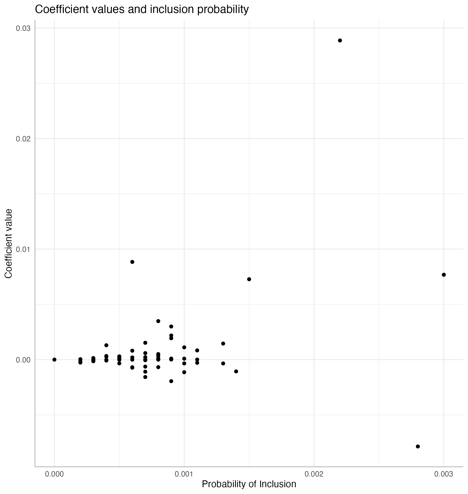
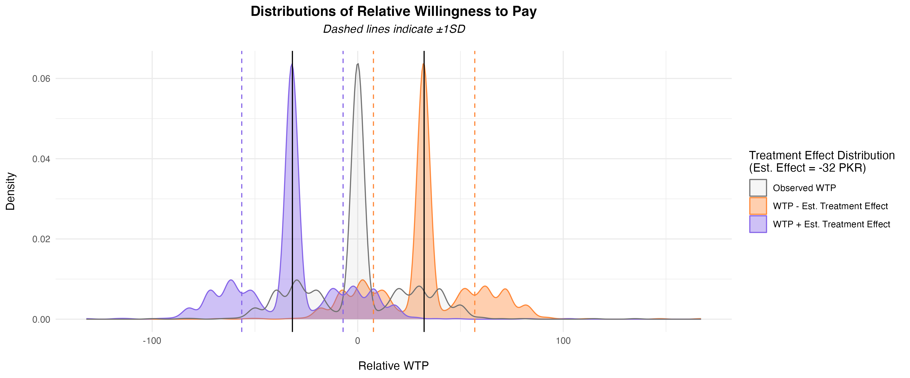
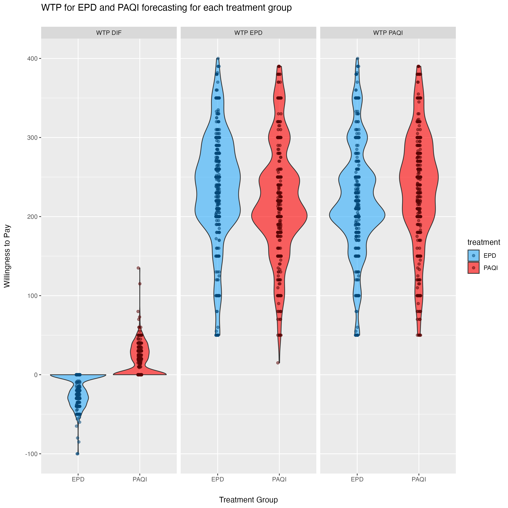
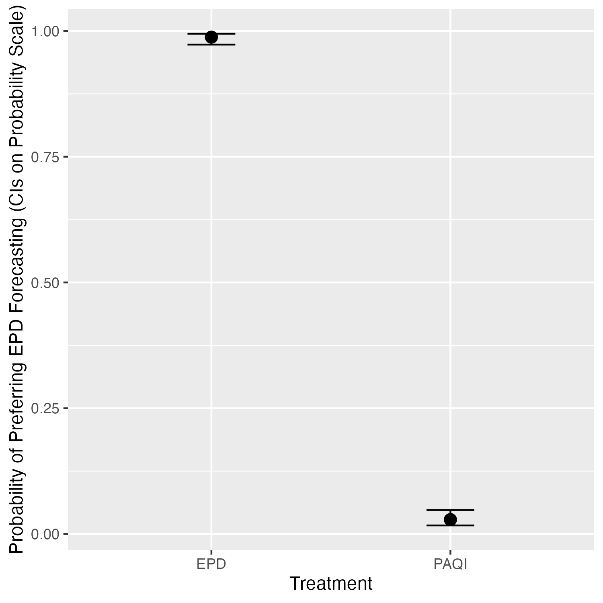
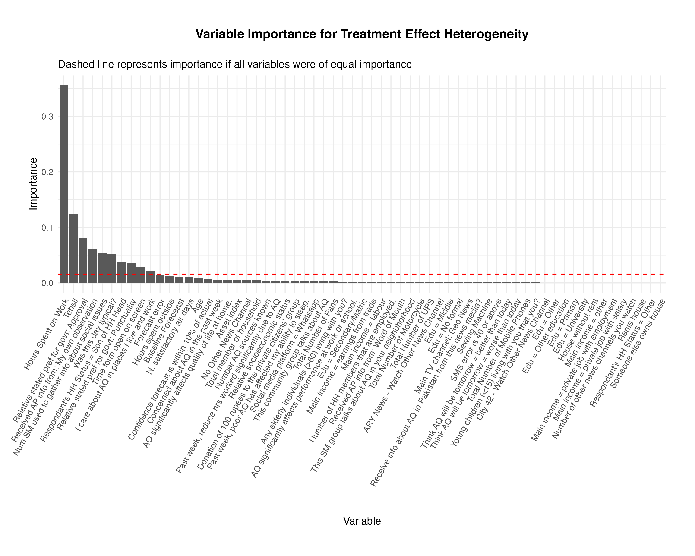
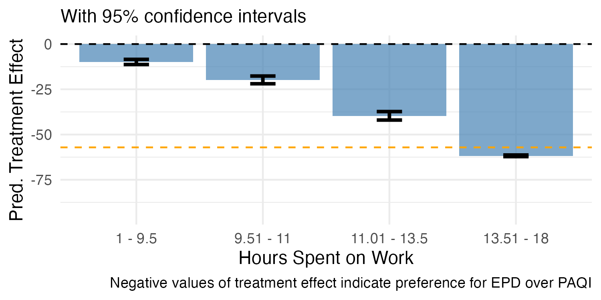
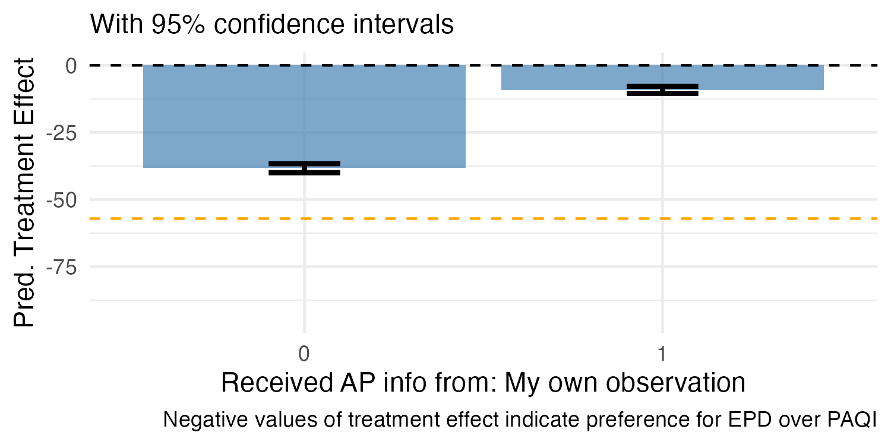
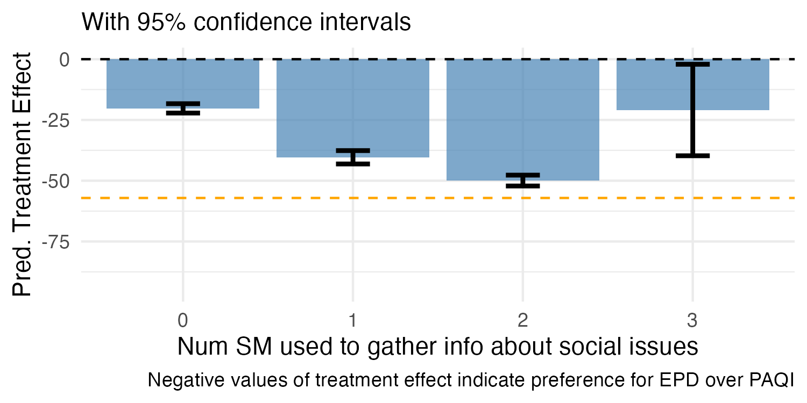

\newpage

**Acknowledgments**

This undergraduate research project uses data from a study on air quality forecasting preferences in Pakistan. Professor Arman Rezaee (Department of Economics, University of California, Davis) is an author on the research project and provided access to the data.

\newpage

# Executive Summary

This report documents an undergraduate exploratory empirical analysis examining willingness to pay (WTP) for air quality forecasting services in Lahore, Pakistan, using data from a research project studying air quality forecasting preferences. The study investigates which variables predict WTP and examines how treatment attribution to different sources—EPD (Environmental Protection Department, government-run) versus PAQI (Pakistan Air Quality Initiative, citizen-run)—affects consumer preferences.

The analysis began as a purely exploratory investigation into what factors predict WTP for air quality forecasting. After testing multiple statistical approaches (OLS, Lasso, Bayesian Spike-and-Slab), the data revealed that treatment assignment was the dominant predictor. Treatment alone explains 42.4% of variance in relative WTP on the full sample. Within treatment groups, exploratory models with all predictors explained up to 66.9%. This finding motivated a shift in focus: not just identifying that treatment matters, but **quantifying how much it matters** and whether that magnitude is large or small.

**Key Finding:** It is intuitive that exposure to a service would influence relative preference for that service. The contribution of this analysis is quantifying the magnitude of that effect and demonstrating that it is very large. The treatment coefficient of approximately -32 PKR corresponds to a Cohen's d of 1.71 (95% CI: [1.56, 1.86])—well above the conventional threshold of 0.8 for a "large" effect. Treatment alone explains 42.4% of variance in relative WTP, approximately **6 times more** than all demographic, behavioral, and household variables combined (R² = 0.071). No other variables consistently predict absolute WTP, and treatment itself explains very little variance in absolute or total WTP (R² < 0.02). However, for relative WTP, causal forest analysis reveals meaningful heterogeneity in treatment effects, with work hours (as an income proxy), geographic location, and baseline government approval explaining approximately 56% of treatment effect variation.

\newpage

# 1. Research Context and Design

## 1.1 Research Question

The study began with an exploratory question: **What variables predict willingness to pay for air quality forecasting services?**

This was not a hypothesis-driven study testing whether specific variables (A) affect outcomes (B). Rather, it was a data-driven exploration allowing multiple analytical methods to identify which variables, if any, consistently predict WTP outcomes.

## 1.2 Study Context

- **Location**: Lahore, Pakistan (households in Shalamar and City Center tehsils)
- **Public health context**: Severe air pollution with documented negative health and educational outcomes
- **Experimental design**: Randomized controlled trial with treatment assignment
- **Treatment arms**:
  - **EPD treatment**: Households received air quality forecasting **attributed to EPD** (Environmental Protection Department, government-run)
  - **PAQI treatment**: Households received air quality forecasting **attributed to PAQI** (Pakistan Air Quality Initiative, citizen-run)

**Critical note**: The forecasting content was **identical** across both treatment groups. The only difference was the source attribution (EPD vs. PAQI). This allows isolation of the effect of source credibility on WTP preferences.

## 1.3 Data Collection

- **Study design**: Two-stage survey with baseline and endline measurements at the household level
- **Survey administration**: Whoever answered the door/agreed to participate provided responses for their household
- **Key measurement categories**:
  - **Demographic variables**: Age, education, household composition, location
  - **Economic proxies**: Work hours (no direct income variable collected)
  - **Behavioral variables**: Time spent on air quality information, forecast error rates when guessing
  - **Attitudinal measures**: Air pollution concern, government approval, preference indices
  - **Outcome measures**: BDM (Bidding Data Model) for WTP

**Note on income**: The dataset does not include a direct income variable. Work hours may serve as an income proxy, which is reasonable in the Pakistan context based on domain knowledge showing that individuals with lower incomes tend to have lower trust in government institutions.

\newpage

# 2. Data Preprocessing

## 2.1 Data Cleaning Pipeline

The preprocessing pipeline (file: `trimming_data/creating_datasets_run.R`) includes:

### Variable Selection and Recoding
- Initially, fewer variables were selected for analysis
- The final approach uses as many baseline variables as possible to be truly exploratory and let the data guide variable selection
- Education recoded into 8 categorical levels
- Likert scales standardized (1-5 scale)
- Binary preference outcomes created from preference indices

### Outcome Variables
Three primary outcomes were constructed:

- `wtp_paqi`: Willingness to pay for PAQI forecasting
- `wtp_epd`: Willingness to pay for EPD forecasting
- `wtp_dif`: **Relative WTP** (wtp_paqi - wtp_epd) — primary outcome of interest

### Quality Control Procedures
1. **Known high-leverage observation removal**: One observation (hhid = 2110) identified as a high-leverage point was removed prior to cleaning
2. **Outlier detection**: Z-score threshold = 4 to identify extreme values
3. **High-frequency variable removal**: Dropped variables with >85% concentration in single response category
4. **Multiple imputation**: Median (numeric) and mode (categorical) strategies for missing data
5. **VIF-based multicollinearity check**: Threshold = 2.5 to remove redundant predictors
6. **Rare factor level combination**: Merged factor levels with <2% frequency to avoid overfitting
7. **High-leverage observation removal**: After all other cleaning steps, observations with leverage (hat values) $\geq$ 0.99 were identified and removed from the full, EPD, and PAQI datasets to prevent numerical instability in robust standard error calculations

The leverage check (step 7) targets observations with unusual combinations of predictor values that would otherwise dominate model fit and cause numerical errors—particularly in HC3 robust standard error estimation.

### Final Sample Sizes

After all cleaning steps:

- **EPD treatment group**: 467 observations
- **PAQI treatment group**: 462 observations
- **Full dataset**: 929 observations

### Summary Statistics

Summary statistics for the three WTP outcome variables were computed across all three cleaned datasets (file: `trimming_data/creating_datasets_run.R`). The table below reports the full dataset statistics; treatment-group-specific summaries are available in the code output.

Table 0: **Summary Statistics — WTP Outcomes (Full Dataset, n = 929)**

| Outcome | Min | 1st Qu. | Median | Mean | 3rd Qu. | Max | SD |
|:--------|----:|--------:|-------:|-----:|--------:|----:|---:|
| WTP PAQI | 50 | 200 | 230 | 229 | 270 | 390 | 68.7 |
| WTP EPD | 15 | 200 | 226 | 228 | 270 | 390 | 68.7 |
| Relative WTP (PAQI $-$ EPD) | -100 | -8 | 0 | 0.28 | 10 | 135 | 24.7 |

*Note: The standard deviation of relative WTP (24.7 PKR) is particularly important for contextualizing the treatment effect magnitude discussed in Section 4.*

The standard deviation of relative WTP (SD = 24.7 PKR) provides the baseline for interpreting how large the treatment effect is. A treatment coefficient of -32 PKR against this spread indicates the treatment shifts preferences by more than one full standard deviation of the outcome distribution. Note also that absolute WTP for both services has nearly identical distributions (mean $\approx$ 228--229 PKR, SD $\approx$ 68.7 PKR), consistent with treatment shifting relative preferences without affecting overall spending levels.

\newpage

# 3. Exploratory Analysis: Predicting Willingness to Pay

The exploratory analysis tested multiple statistical approaches to identify which variables, if any, consistently predict WTP. This was **not conducted in phases**—rather, different methods were applied in parallel to allow comparison and triangulation of results.

## 3.1 Analytical Approaches

### 3.1.1 Ordinary Least Squares Regression

**File**: `linear_regression_exploratory/OLS_exploratory.R`

- 6 model combinations: 2 treatment groups (EPD: n = 467; PAQI: n = 462) × 3 outcomes (WTP for PAQI, WTP for EPD, relative WTP)
- Full models with all baseline predictors
- Benjamini-Hochberg correction for multiple comparisons to control false discovery rate
- Variables with p < 0.05 considered for interpretation

### 3.1.2 Lasso Regression with Cross-Validation

**File**: `holdout_sets/lasso.R`

- L1-regularized regression with cross-validation for lambda selection
- **Sample splitting**: 70/30 train-test split for validation
- Variable selection based on non-zero coefficients at optimal lambda
- Compared Lasso → OLS pipeline performance against OLS alone

### 3.1.3 Bayesian Spike-and-Slab Prior

**File**: `spike_and_slab/spike_slab.R`

- BoomSpikeSlab implementation with 10,000 MCMC iterations
- Expected model size = 10 variables (prior specification)
- Posterior inclusion probabilities calculated for each predictor
- Analysis conducted on full dataset predicting relative WTP (wtp_dif)

**Results**: The highest posterior inclusion probability was very low, indicating substantial uncertainty about which variables truly predict relative WTP. Most variables had inclusion probabilities well below 50%, suggesting weak evidence for any individual predictor when treatment is not included in the model.

{width=85%}

**Figure 1**: Bayesian Spike-and-Slab posterior coefficient distributions showing relationship between inclusion probability and coefficient value. Most variables cluster near zero inclusion probability, indicating weak evidence for predictive value.

## 3.2 Comparison: OLS vs. Lasso

A comparison examined whether machine learning variable selection (Lasso) improved predictive performance over standard OLS regression. Both approaches were compared on the same outcomes to evaluate whether regularization and automated variable selection provided benefits.

This comparison was of interest simply because both these methods were used in the exploratory analysis, but the comparison is not the purpose of the investigation.

Table 1: **Model Performance Comparison - OLS vs. Lasso**

| Group | Outcome | OLS R² | OLS Vars | Lasso R² | Lasso Vars |
|:------|:------------|-------:|--------:|--------:|----------:|
| PAQI | \mbox{WTP PAQI} | 0.239 | 3 | 0.140 | 34 (2) |
| PAQI | \mbox{WTP EPD} | 0.236 | 7 | 0.164 | 35 (5) |
| PAQI | \mbox{WTP Diff} | 0.609 | 9 | 0.558 | 47 (10) |
| EPD | \mbox{WTP PAQI} | 0.225 | 7 | 0.076 | 25 (2) |
| EPD | \mbox{WTP EPD} | 0.211 | 7 | 0.020 | 1 (1) |
| EPD | \mbox{WTP Diff} | 0.669 | 12 | 0.648 | 46 (13) |

*Note: Lasso variables shown as "total selected (significant after OLS on selected variables)". PAQI treatment group n = 462; EPD treatment group n = 467.*

**Key observation**: Lasso either did not improve R² over OLS or actually decreased it. For predicting relative WTP (the outcome with highest R² in both approaches), OLS achieved R² = 0.609–0.669 while Lasso achieved R² = 0.558–0.648. The machine learning approach with regularization did not provide additional predictive value beyond standard OLS.

## 3.3 Exploratory Analysis Results

### Few Variables Consistently Predict Absolute WTP

- No demographic, behavioral, or household variable robustly predicts absolute WTP across treatment groups
- Variables selected by OLS vary substantially by treatment group and outcome type
- Lasso selects many variables but with poor out-of-sample performance (low R²)
- Bayesian Spike-and-Slab typically selects 1-15 variables per model, with extremely low posterior inclusion probabilities

### Treatment Assignment Dominates for Relative WTP

The models predicting relative WTP (wtp_dif) show substantially higher R² values:

- PAQI treatment group: R² = 0.558–0.609
- EPD treatment group: R² = 0.648–0.669

This pattern emerges consistently across all analytical methods, suggesting that treatment assignment is the primary driver of preferences for one service over the other.

\newpage

# 4. Treatment Effect Analysis

Given that relative WTP showed strong predictive performance while absolute WTP did not, the analysis shifted focus to understanding treatment effects.

## 4.1 Relative WTP Regression Models

**File**: `linear_regression_treatment_effect/OLS_treatment_effect_relWTP.R`

All models use **HC3 heteroskedasticity-robust standard errors** (via the `sandwich` package). Clustering was not feasible because the dataset does not contain geographic cluster identifiers.

Three model specifications were compared:

Table 2: **Treatment Effect Model Comparison — Relative WTP (Full Dataset, n = 929)**

| Model Specification | R² | F-stat p-value | Treatment Coefficient |
|:-------------------|----:|:--------------:|---------------------:|
| Treatment only | 0.424 | < 0.001*** | -32.1 |
| All covariates (no treatment) | 0.071 | 0.381 (ns) | — |
| Treatment + all covariates | 0.460 | < 0.001*** | -32.0 |

*Note: \*\*\* indicates p < 0.001; ns = not significant. Standard errors are HC3-robust.*

### Key Observations

1. Treatment alone explains **42.4% of variance** in relative WTP
2. All other variables combined (without treatment) explain only **7.1% of variance**
3. Adding covariates to the treatment model increases R² by only 3.6 percentage points (to 46.0%)
4. Treatment effect coefficient remains stable at approximately **-32.0 PKR** regardless of controls

### Magnitude of the Treatment Effect

**File**: `linear_regression_treatment_effect/investigating_treatment_effect.R`

It is intuitive that exposure to a service would shape relative preference for that service. The key question is not *whether* treatment matters, but **how much** it matters—and whether that magnitude is large or small in standardized terms.

The treatment coefficient of **-32.0 PKR** represents a substantial and economically meaningful preference shift. Households assigned to EPD treatment have a relative WTP that is 32 PKR lower (more favorable toward EPD) than households assigned to PAQI treatment—holding all else equal. Simply being exposed to a government-attributed forecast rather than a citizen-attributed forecast shifts a household's relative valuation by about 32 PKR on average.

#### Effect Size: Cohen's d

To quantify the treatment effect in standardized terms, Cohen's d was computed for the treatment-only model predicting relative WTP:

- **Cohen's d = 1.71** (95% CI: [1.56, 1.86])
- By conventional benchmarks (Cohen, 1988): d = 0.2 is "small," d = 0.5 is "medium," d = 0.8 is "large"
- **The treatment effect is more than twice the threshold for a "large" effect**

This means the average difference in relative WTP between treatment groups is 1.71 pooled standard deviations—an effect size rarely observed in social science research. Source attribution alone generates a preference gap that dwarfs the natural person-to-person variation in service preferences.

#### Treatment vs. All Other Predictors

The variance explained by treatment alone (R² = 0.424) can be compared to the variance explained by all other demographic, behavioral, and household variables combined (R² = 0.071):

$$\frac{R^2_{\text{treatment}}}{R^2_{\text{all other variables}}} = \frac{0.424}{0.071} \approx 6$$

Treatment explains approximately **6 times more variance** in relative WTP than every other measured variable combined. This ratio underscores that treatment is not merely the strongest predictor—it is overwhelmingly dominant.

#### Visualizing the Treatment Effect

{width=90%}

**Figure 2**: Density distributions of relative WTP shifted by the estimated treatment effect (-32 PKR). The orange distribution shows WTP shifted down by the treatment effect; the purple distribution shows WTP shifted up. Dashed lines indicate ±1 SD. The clear separation between shifted distributions illustrates that the treatment effect is larger than the natural spread of preferences—consistent with a Cohen's d exceeding 1.7.

### Stability Across Random Splits

To check stability of the treatment effect estimate, the full dataset was randomly split in half multiple times:

- Treatment coefficients range: -31.2 to -33.7 PKR
- R² range: 0.41 to 0.51
- Treatment remains highly significant (p < 0.001) across all splits

This indicates the treatment effect estimate is stable and not driven by particular observations.

## 4.2 Absolute and Total WTP

**File**: `linear_regression_treatment_effect/OLS_treatment_effect_absWTP.R`

To investigate whether treatment predicts absolute WTP (not just relative preference), treatment-only models were fit for WTP for PAQI alone, WTP for EPD alone, and total WTP (WTP PAQI + WTP EPD). All models use HC3-robust standard errors.

Table 3: **Treatment Effect on Absolute and Total WTP (Full Dataset, n = 929)**

| Outcome | R² | Treatment Coefficient | p-value |
|:--------|----:|---------------------:|--------:|
| WTP for PAQI | 0.012 | -15.1 | 0.001 |
| WTP for EPD | 0.015 | 16.9 | < 0.001 |
| Total WTP (PAQI + EPD) | $\approx$ 0 | 1.9 | 0.831 |

### Key Observations

- Treatment explains very little variance in absolute WTP for either service individually (R² < 0.02)
- Treatment explains essentially **zero variance** in total WTP (R² $\approx$ 0, p = 0.831)
- The coefficients show that EPD treatment recipients are willing to pay slightly more for EPD and slightly less for PAQI, but these effects largely cancel out in total WTP
- **Interpretation**: Treatment shifts *relative* preferences between services but does not change households' overall willingness to spend on air quality forecasting

## 4.3 Distribution of Willingness to Pay

{width=85%}

**Figure 3**: Violin plots of willingness to pay by treatment assignment for three outcomes: relative WTP (WTP DIF = WTP PAQI minus WTP EPD), absolute WTP for EPD, and absolute WTP for PAQI. The relative WTP panel shows clear separation by treatment group, while the absolute WTP panels show substantial overlap—consistent with treatment affecting preferences between services but not overall spending levels.

## 4.4 Binary Preference Analysis

**File**: `linear_regression_treatment_effect/log_odds.R`

Logistic regression predicting binary preference for EPD vs. PAQI (n = 929):

{width=75%}

**Figure 4**: Predicted probability of preferring EPD over PAQI by treatment assignment, shown on the probability scale with 95% confidence intervals. EPD treatment recipients have approximately 97% probability of preferring EPD, while PAQI treatment recipients have approximately 5% probability of preferring EPD. The plot shows near-perfect separation by treatment group.

**Statistical result**: Near-perfect separation by treatment (quasi-complete separation in logistic model)

**Interpretation**: Receiving EPD forecasting makes a household almost certain to prefer EPD over PAQI, and vice versa.

\newpage

# 5. Heterogeneous Treatment Effects

While treatment dominates overall preferences, there may be meaningful variation in treatment effects across different types of households. Causal forests provide a nonparametric approach to investigating this.

## 5.1 Causal Forest Implementation

**Files**:
- `linear_regression_treatment_effect/causal_forest/causal_forest.R`
- `linear_regression_treatment_effect/causal_forest/causal_forest_work_trimmed.R`

### Method Details

- **Algorithm**: Generalized Random Forest (grf package)
- **Number of trees**: 4,000 with honest splitting
- **Treatment variable**: EPD assignment (binary)
- **Outcome variable**: Relative WTP (wtp_dif)
- **Sample size**: 929 observations (full dataset)
- **Predictor variables**: 50+ baseline variables (64 columns after dummy coding of categorical variables)

## 5.2 Variable Importance Rankings

{width=85%}

**Figure 5**: Variable importance rankings from causal forest showing which variables best predict heterogeneous treatment effects. Work hours dominates, followed by geographic location (tehsil), baseline government approval, and air pollution information source.

Table 4: **Top Predictors of Treatment Effect Heterogeneity**

| Variable | Importance (Full) | Importance (Trimmed) | Interpretation |
|:---------|------------------:|---------------------:|:---------------|
| **Work hours (total)** | 0.356 | 0.361 | Income proxy; strongest predictor |
| **Tehsil (location)** | 0.124 | 0.137 | Geographic heterogeneity |
| **Government approval** | 0.081 | 0.058 | Prior attitudes toward government |
| **AP info from observation** | 0.062 | 0.058 | Information source behavior |
| **Number of social media** | 0.054 | 0.051 | Information access/connectivity |
| **Was this day typical?** | 0.052 | 0.064 | Baseline conditions |

*Note: "Full" = full dataset (n = 929); "Trimmed" = work hours trimmed to 5th--95th percentile (n = 876). Rankings are broadly consistent across both analyses.*

## 5.3 Heterogeneity by Work Hours

Work hours emerged as the dominant moderator of treatment effects.

### Best Linear Projection Analysis

- **Coefficient (full dataset, n = 929)**: Each additional work hour per week decreases treatment effect by **8.2 PKR** (SE = 0.40, p < 0.001)
- **Coefficient (trimmed dataset, n = 876)**: Each additional work hour per week decreases treatment effect by **9.8 PKR** (SE = 0.39, p < 0.001)
- Both estimates use the heteroskedasticity-robust standard errors from the grf package's best_linear_projection() function
- **Interpretation**: Individuals working longer hours (higher income) show stronger preference for EPD (government) forecasting when treated with EPD. The effect is robust to trimming extreme work hour values and, if anything, slightly stronger in the trimmed sample.

{width=85%}

**Figure 6**: Treatment effect heterogeneity by work hours quartiles. Households with more work hours show larger (more negative) treatment effects, indicating stronger preference shifts toward EPD when exposed to EPD forecasting. Error bars show 95% confidence intervals. The dashed orange line represents -25% of average WTP as a reference threshold.

### Income Proxy Interpretation

- The dataset does not include a direct income variable
- Work hours serves as a reasonable income proxy in this context
- **Domain knowledge**: In Pakistan, lower-income individuals tend to have lower trust in government institutions
- This pattern suggests higher-income households (longer work hours) are more receptive to government-provided services

### Robustness to Extreme Values

- Analysis repeated with work hours trimmed to 5th--95th percentile (file: `causal_forest_work_trimmed.R`, n = 876)
- Variable importance of work hours remains dominant (0.361 trimmed vs. 0.356 full)
- BLP coefficient slightly larger in trimmed sample (-9.8 vs. -8.2 PKR per hour), suggesting the full-sample estimate is conservative
- Top variable rankings broadly consistent across both analyses (see Table 4)
- Confirms findings are not driven by outliers in work hours distribution

## 5.4 Heterogeneity by Geographic Location

{width=75%}

**Figure 7**: Treatment effect heterogeneity by tehsil (Shalamar vs. City Center). Shalamar shows larger (more negative) treatment effects, suggesting geographic variation in government service preferences.

**Observations**:
- **Shalamar**: Larger (more negative) treatment effects
- **City Center**: Smaller treatment effects
- **Possible explanation**: Income or socioeconomic differences between geographic areas

## 5.5 Heterogeneity by Government Approval

{width=75%}

**Figure 8**: Treatment effect heterogeneity by baseline government approval. Households with higher baseline government approval show larger treatment effects when exposed to EPD forecasting, consistent with prior attitudes moderating treatment responses.

**Pattern**:
- Positive government approval → More receptive to EPD treatment
- Negative government approval → More resistant to EPD treatment
- Consistent with Bayesian updating models where prior beliefs moderate new information

## 5.6 Other Important Variables

{width=70%}

**Figure 9**: Treatment effect heterogeneity by whether respondents received air pollution information from their own observation (importance = 0.062).

{width=70%}

**Figure 10**: Treatment effect heterogeneity by number of social media platforms used, showing modest variation (importance = 0.054).

## 5.7 Summary of Heterogeneity

While treatment assignment dominates overall preferences, there is meaningful heterogeneity driven by:

1. **Work hours (income proxy)**: 35.6--36.1% of heterogeneity
2. **Geographic location**: 12.4--13.7% of heterogeneity
3. **Baseline government approval**: 5.8--8.1% of heterogeneity

Together, these three variables explain approximately **54--58% of treatment effect variation** across households, stable across full and trimmed analyses.

\newpage

# 6. Key Findings

## Finding 1: Treatment Assignment Dominates Relative Preferences—and the Effect Is Very Large

It is intuitive that exposure to a service would influence relative preference. The contribution here is quantifying how much it matters.

**Statistical Evidence**:
- Treatment-only model: R² = 0.424 (n = 929)
- All other variables combined (no treatment): R² = 0.071
- Treatment explains **~6 times more variance** than all other variables combined
- Effect size: **-32.0 PKR** difference in relative WTP
- **Cohen's d = 1.71** (95% CI: [1.56, 1.86])—more than twice the "large" threshold (0.8)
- Near-perfect separation in binary preference analysis
- HC3-robust standard errors confirm significance
- Coefficient stable across random splits (-31.2 to -33.7 PKR)

**Interpretation**: Which air quality forecasting service a household receives is by far the strongest predictor of which service they will prefer and be willing to pay for. The magnitude of this effect is not merely statistically significant—a Cohen's d of 1.71 places it well above the conventional "large" threshold and indicates that the treatment-induced preference gap exceeds the natural person-to-person variation in service preferences. Source attribution alone, with identical forecasting content, generates a preference shift of approximately 32 PKR that is larger than one would expect from any combination of demographic, behavioral, or household characteristics.

## Finding 2: Treatment Does Not Predict Absolute or Total WTP

- Treatment explains very little variance in absolute WTP for either service (R² < 0.02)
- Treatment explains essentially zero variance in total WTP (R² $\approx$ 0, p = 0.831)
- Treatment shifts relative preferences but does not change overall spending willingness
- Suggests the mechanism is preference formation, not demand creation

## Finding 3: Few Variables Consistently Predict Absolute WTP

- No demographic, economic, or behavioral variable robustly predicts absolute WTP across treatment groups
- Results vary substantially by treatment group and outcome type
- Findings inconsistent across modeling approaches (OLS, Lasso, Bayesian)
- Suggests absolute WTP is driven by factors not captured in the survey or is highly idiosyncratic

## Finding 4: Machine Learning Variable Selection Does Not Improve Performance

- Lasso regression with cross-validation either matched or underperformed OLS
- For relative WTP: OLS R² = 0.609–0.669 vs. Lasso R² = 0.558–0.648
- Lasso selected many variables but with poor predictive performance
- Simple OLS with fewer variables achieved better or equivalent out-of-sample fit

## Finding 5: Work Hours (Income Proxy) Drives Treatment Effect Heterogeneity

**Quantitative Evidence**:
- Variable importance: 0.356--0.361 (highest among all predictors; full and trimmed datasets)
- Best linear projection: 8.2--9.8 PKR per additional work hour (p < 0.001)
- Effect robust to trimming extreme values; trimmed estimate is slightly larger, suggesting full-sample estimate is conservative

**Interpretation**:
- Work hours serves as income proxy (no direct income variable available)
- Higher income associated with stronger preference for government services
- Consistent with domain knowledge: lower-income individuals in Pakistan have lower government trust

## Finding 6: Geographic and Attitudinal Heterogeneity

**Geographic Effects**:
- Tehsil explains 12.4--13.7% of treatment effect heterogeneity
- Shalamar shows larger treatment effects than City Center

**Attitudinal Effects**:
- Baseline government approval explains 5.8--8.1% of heterogeneity
- Prior beliefs moderate treatment response

**Combined**: Work hours + Location + Government approval = approximately 54--58% of treatment effect variation

\newpage

# 7. Methodological Approach

## 7.1 Exploratory, Data-Driven Analysis

This study was **exploratory** rather than hypothesis-driven:

- No a priori hypotheses about specific variables affecting WTP
- Multiple analytical methods applied to let data guide variable selection
- Comparison across methods to identify robust patterns
- Willingness to follow data toward unexpected findings (treatment dominance)

## 7.2 Multiple Analytical Methods

The study employed multiple complementary approaches:

**Frequentist Methods**:
- OLS regression (baseline approach)
- Lasso with cross-validation (machine learning variable selection with sample splitting)

**Bayesian Methods**:
- Spike-and-Slab priors for probabilistic variable selection

**Causal Inference**:
- Causal forests for heterogeneous treatment effect discovery

**Sample Splitting**:
- Lasso analysis used 70/30 train-test split
- Other methods (OLS, Spike-and-Slab) used full dataset
- Best subset selection was considered but not used because the final dataset was too large

**Robust Inference**:
- Treatment effect OLS models use HC3 heteroskedasticity-robust standard errors (via the `sandwich` and `lmtest` packages)
- Clustering was not feasible due to the absence of geographic cluster identifiers in the dataset
- HC3 robust standard errors are preferred over HC0-HC2 for finite-sample correction

**Strength**: Agreement across methods that few variables consistently predict absolute WTP strengthens this negative finding. Different approaches (frequentist OLS, regularized Lasso, Bayesian Spike-and-Slab) all point to the same conclusion despite different assumptions and selection mechanisms.

## 7.3 Data Quality: Leverage-Based Cleaning

High-leverage observations—those with unusual combinations of predictor values—were identified and removed to ensure numerical stability:

- **Threshold**: Hat values $\geq$ 0.99 (near-perfect leverage)
- **Rationale**: Observations with leverage close to 1 are perfectly predictable from their covariate patterns, causing numerical instability particularly in HC3 robust standard error calculations
- **Applied at two stages**: (1) a known problematic observation removed prior to cleaning, and (2) systematic leverage screening applied after all other cleaning steps to all three datasets (full, EPD, PAQI)

## 7.4 Evolution of Variable Selection

- **Initial approach**: Smaller subset of variables selected
- **Final approach**: As many baseline variables as possible included to be truly exploratory
- **Rationale**: Without domain expertise in this area, the analysis included all available baseline variables to let the data reveal patterns rather than imposing prior beliefs about which variables might matter

## 7.5 Limitations of Selective Inference

**File**: `selective_inference/selective_inference_run.R`

- Fixed Lasso Inference attempted for valid post-selection inference
- **Issues encountered**:
  - Assumptions for the selective inference package were not met
  - Package is not actively maintained
  - Developer (Joshua Loftus) did not respond to inquiry
- **Outcome**: Results not included in final analysis due to methodological concerns

## 7.6 Causal Forest Innovation

Causal forests successfully discovered treatment effect heterogeneity that traditional regression methods might miss:

- Nonparametric approach to identifying effect modifiers
- Variable importance rankings provide clear guidance
- Best linear projection quantifies heterogeneity for continuous moderators

\newpage

# 8. Project Organization

## 8.1 Repository Structure

**Main Directory**: `/Users/teorichard/Downloads/UCD Research/AQ UCD/`

**Key Subdirectories and Files**:

- **trimming_data/**
  - `creating_datasets_run.R` - Main data cleaning pipeline (includes leverage checks and summary statistics)
  - `create_fns.R` - Helper functions for cleaning, imputation, VIF, and leverage diagnostics

- **linear_regression_exploratory/**
  - `OLS_exploratory.R` - Exploratory OLS analysis
  - `create_ols_tables.R` - Table formatting
  - `ols_expl_rmd_files/` - Output CSVs

- **linear_regression_treatment_effect/**
  - `OLS_treatment_effect_relWTP.R` - Treatment effect models for relative WTP (HC3 robust SEs)
  - `OLS_treatment_effect_absWTP.R` - Treatment effect models for absolute and total WTP (HC3 robust SEs)
  - `investigating_treatment_effect.R` - Effect size analysis (Cohen's d, variance ratios, distribution plots)
  - `log_odds.R` - Binary preference analysis
  - `wtp_by_treatment.png` - Distribution of WTP by treatment group
  - `treatment_effect_distr.png` - Treatment effect distribution visualization
  - `log_odds_plot.png` - Log-odds visualization
  - **causal_forest/** subdirectory:
    - `causal_forest.R` - Full causal forest analysis
    - `causal_forest_work_trimmed.R` - Robustness check with trimmed work hours
    - `causal_forest_fns.R` - Plotting helpers
    - `variable_importance_df.csv` - Variable importance rankings
    - `images/` - Treatment effect heterogeneity plots

- **spike_and_slab/**
  - `spike_slab.R` - Bayesian variable selection
  - `spikeslabcoefs.png` - Posterior coefficient distributions

- **selective_inference/**
  - `selective_inference_run.R` - Fixed Lasso Inference (not used in final analysis)
  - `selective_inference_fns.R` - Helper functions

- **holdout_sets/**
  - `lasso.R` - Lasso with cross-validation and train-test split
  - `holdout_fns.R` - Sample splitting utilities

- **final_stuff/**
  - `ols_final_glance.csv` - OLS summary results
  - `l_final_glance.csv` - Lasso summary results
  - `si_final_glance.csv` - Selective inference results

## 8.2 Analytical Workflow

The analytical pipeline:

1. **Data Cleaning & Summary Statistics** → `trimming_data/creating_datasets_run.R` (includes leverage-based observation removal and descriptive statistics)
2. **Exploratory Analysis** → Parallel application of OLS, Lasso, Spike-and-Slab
3. **Method Comparison** → Compare variable selection and R² across approaches
4. **Treatment Effect Analysis** → `OLS_treatment_effect_relWTP.R`, `OLS_treatment_effect_absWTP.R`, `log_odds.R`
5. **Effect Size Quantification** → `investigating_treatment_effect.R` (Cohen's d, variance ratios, distributional analysis)
6. **Heterogeneous Effect Discovery** → `causal_forest.R`
7. **Results Visualization** → Multiple plots showing distributions and heterogeneity
8. **Results Compilation** → `final_stuff/` summary CSVs

\newpage

# 9. Conclusions

## 9.1 Contributions

### Main Contribution

It is intuitive that exposure to a service would influence preference for that service—the "mere exposure effect" from behavioral psychology would predict this. The main contribution of this analysis is **quantifying how large that effect is** and demonstrating that it is not merely present but dominant. With a Cohen's d of 1.71 and a variance ratio of approximately 6:1 (treatment vs. all other variables), the data show that source attribution alone generates preference shifts that exceed the natural variation in service preferences across the population. Few demographic, economic, or behavioral variables consistently predict WTP, but exposure to a particular service creates overwhelming preferences for that service. Importantly, this effect operates through relative preference formation—treatment shifts which service households prefer—without changing their overall willingness to spend on air quality forecasting.

### Methodological Contribution

The study demonstrates the value of:

1. **Exploratory, data-driven approaches** that let findings guide analysis rather than testing pre-specified hypotheses
2. **Triangulation across methods** to identify robust patterns (treatment dominance) and method-specific limitations (Lasso underperformance)
3. **Causal forests for heterogeneity discovery** that reveal systematic variation in treatment effects even when average effects dominate
4. **Robust inference** using HC3 heteroskedasticity-robust standard errors to address potential heteroskedasticity in treatment effect estimation

### Policy Contribution

The findings suggest that **increasing exposure** to government air quality forecasting services (through free trials, expanded communication) may shift preferences. However, **targeting strategies** should account for income (work hours) and geographic heterogeneity, as treatment effects vary systematically across these dimensions.

## 9.2 Key Takeaways

1. Exposure to a service creating preference for that service is expected. What is notable is the **magnitude**: a Cohen's d of 1.71 and treatment explaining 6 times more variance than all demographics combined demonstrates that source attribution is not just one factor among many—it is overwhelmingly dominant.

2. Exploratory analysis with multiple methods can reveal patterns in data without requiring domain expertise or prior hypotheses. Agreement across methods on negative findings (few predictors of absolute WTP) is as informative as agreement on positive findings. Machine learning variable selection (Lasso) does not always improve prediction over OLS.

3. The barrier to preference formation may be awareness and access rather than fundamental differences in service quality perceptions. Income and geographic targeting may improve effectiveness.

4. Treatment affects which service households prefer, but not how much they are willing to spend overall on air quality forecasting—suggesting exposure creates preference, not demand.

## 9.3 Limitations

**Data limitations**:
- No direct income variable (work hours used as proxy)
- Cross-sectional treatment assignment limits causal interpretation of mechanisms
- Survey-based WTP may not reflect actual behavior
- No geographic cluster identifiers available for clustered standard errors

**Methodological limitations**:
- Selective inference package assumptions not met; results not included
- Best subset selection not feasible with large variable set
- Potentially limited external validity beyond Lahore, Pakistan context; Lahore is a large, heavily polluted urban center and may not be representative of Pakistan as a whole or of smaller cities and rural areas

**Measurement limitations**:
- BDM elicitation method may not perfectly capture true WTP
- Self-reported data subject to social desirability bias
- Composite indices (government approval) have uncertain internal validity

## 9.4 Future Research

1. **Mechanism testing**: Explicitly test psychological mechanisms (familiarity, trust, perceived quality)
2. **Longitudinal analysis**: Track preference stability after treatment exposure ends
3. **Behavioral validation**: Link stated WTP to actual service usage behavior
4. **Income measurement**: Collect direct income data to validate work hours as proxy
5. **Cross-context replication**: Test generalizability in other countries or service domains
6. **Absolute WTP investigation**: Explore what factors (beyond treatment) drive absolute willingness to pay levels

\newpage

# Appendix: Technical Details

## A.1 Statistical Methods Summary

### Ordinary Least Squares (OLS)
- **Software**: R base `lm()` function
- **Significance testing**: F-tests and t-tests
- **Multiple comparison correction**: Benjamini-Hochberg procedure
- **Model selection**: Stepwise selection based on AIC
- **Robust inference (treatment effect models)**: HC3 heteroskedasticity-robust standard errors via `sandwich::vcovHC()` and `lmtest::coeftest()`

### Lasso Regression
- **Software**: R `glmnet` package
- **Lambda selection**: 10-fold cross-validation
- **Sample splitting**: 70/30 train-test split for validation
- **Variable selection**: Non-zero coefficients at optimal lambda

### Bayesian Spike-and-Slab
- **Software**: R `BoomSpikeSlab` package
- **Prior specification**: Expected model size = 10 variables
- **MCMC settings**: 10,000 iterations, ping = 1000
- **Variable selection**: Posterior inclusion probability threshold

### Causal Forest
- **Software**: R `grf` package
- **Algorithm**: Generalized Random Forest with honest splitting
- **Hyperparameters**: 4,000 trees, default tuning
- **Inference**: Best linear projection for continuous moderators (HC3-robust)
- **Variable importance**: Depth-weighted splits

## A.2 Software Environment

**Programming language**: R (version 4.x+)

**Key packages**:
- Data manipulation: `dplyr`, `tidyr`
- Visualization: `ggplot2`, `ggdist`
- Machine learning: `glmnet`, `grf`
- Bayesian inference: `BoomSpikeSlab`
- Statistical modeling: `lm`, `glm`
- Robust inference: `sandwich`, `lmtest`
- Effect sizes: `effsize` (Cohen's d computation)

## A.3 Data Privacy Note

The data used in this undergraduate research project is from a study on air quality forecasting preferences in Pakistan. Professor Arman Rezaee (Department of Economics, UC Davis) is an author on the research project and provided access to the data for this analysis. The data remains private and is used here with his permission. Without access to the data, the code in this repository will not run correctly.

## A.4 Model Abbreviations

In tables and file names:

- **pd**: PAQI treatment group
- **ed**: EPD treatment group
- **wp**: WTP for PAQI (outcome)
- **we**: WTP for EPD (outcome)
- **wd**: WTP difference / relative WTP (outcome)

\newpage

**End of Report**

GitHub Repository: [https://github.com/teo-richard/ucd_aq_proj](https://github.com/teo-richard/ucd_aq_proj)
